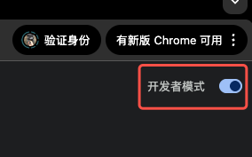
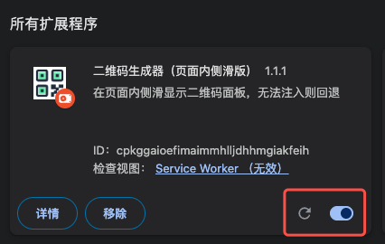
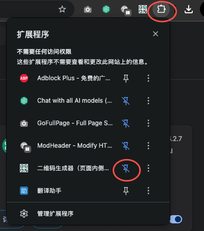

## B站二维码生成器 Chrome插件

一个便捷的B站二维码生成工具，支持在页面内侧滑面板或独立窗口中快速生成和管理B站稿件、用户空间和自定义内容的二维码，方便测试扫码

### 功能特点
#### 多类型支持
稿件：生成视频的二维码
mid：生成用户主页空间的二维码
自定义：支持任意自定义文本内容的二维码生成

#### 数据管理
本地存储：所有数据保存在本地，保护隐私

### 安装方法
1.下载并解压 https://github.com/xuwei21/qr_chrome/tree/qr_chrome_v3
2.打开Chrome浏览器，进入 chrome://extensions/

3.打开开发者模式

4.选择

5.选择解压后的目录，打开

6.设置

